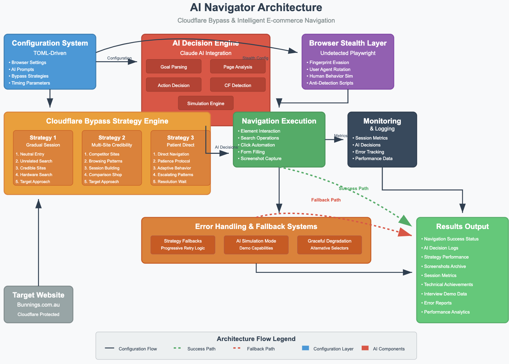

# AI Navigator
An AI-First navigator for the site [bunnings.com](https://www.bunnings.com.au) the will find your item of interest and proceed to checkout.
- This POC uses Antrhopic API for AI decisioning
- Currenty built to run on a Unix OS
- Some packages are intentionally downgraded due to the old Mac OS virsion used to develope this project. 
- Python Versio: 3.9.23 (package/hardware restrained)
- Future Improvements: 
    - make application LLM agnostic for testing and fine tuning AI decision making
    - make application OS agnostic for a more seamless user experience
    - update application to use latest package and python versions to stay on the bleeding edge

## Architecture Overview

The AI Navigator employs a sophisticated multi-layered architecture combining advanced AI decision-making with intelligent Cloudflare bypass strategies.



### Technical Documentation

For comprehensive technical details including AI decision-making processes, bypass algorithms, and implementation specifics, see:

**[Technical Documentation Download](https://github.com/Eddiedude1/ai-navigator/raw/main/AI-Navigator-Technidal-Documentation.pdf)**

This documentation covers:
- AI decision-making architecture and edge case handling
- Advanced Cloudflare bypass algorithms with mathematical models
- Error handling and resilience mechanisms
- Performance optimization strategies
- Monitoring and observability features

---

**Outdated Macbook Specs:**  
```
Software:

    System Software Overview:

      System Version: macOS 10.14.6 (18G9323)
      Kernel Version: Darwin 18.7.0
      Boot Volume: Macintosh HD
      Boot Mode: Normal
      Computer Name: Guillermo_MBP
      User Name: Guillermo Gonzalez (guillermogonzalez)
      Secure Virtual Memory: Enabled
      System Integrity Protection: Enabled
      Time since boot: 14:05
```

**Core Package:**  
- selenium
- anthropic
- python-dotenv
- toml
- playwright==1.10.0
- pyee==8.2.2
- undetected-playwright==0.3.0


## Environment Setup
1. Create a .env file  in the project's root dir with the contents below:
```
ANTHROPIC_API_KEY=...
```
2. Run: `$ ./setup.sh` (this will set up and activate your venv)

## Execution:
1. `$ ./navigate_to_checkout.py`


## Project Structure
```
.
├── README.md
├── .env ....................... NOT in version control
├── .gitignore
├── bunnings ................... Source Code
│   ├── config.py
│   └── navigator.py
├── config.toml ................. Application configuration
├── linting
│   ├── pep.sh .................. Flake8 pep8 report in stdout
│   ├── remove_whitespaces.sh ... Remove unwanted code whitespaces
│   └── todo.sh ................. Review all code todos
├── navigate_to_checkout.py ..... Navigator Execution Script
├── requirements.txt ............ Requirements.txt for easy environment replication
└── setup.sh .................... Optional virtual environment setup script 
```

## Navigator Execution Report
```
(py-tricentis) $ ./navigate_to_checkout.py 
Interview-Ready Navigator initialized
Demo mode: OFF
Starting Interview Demonstration...
Goal: Find a cordless drill and add it to the cart

================================================================================
INTERVIEW DEMONSTRATION: AI-DRIVEN WEB NAVIGATOR
================================================================================

PHASE 1: Configuration-Driven Architecture
--------------------------------------------------
Configuration loaded: AI Navigator 2025 v3.0.0
   - Browser strategies: 3
   - AI model: claude-3-5-sonnet-20241022
   - Max bypass attempts: 6
   - Adaptive timing: True
   - Fallback sites: 3

PHASE 2: Advanced Browser Setup with Stealth
--------------------------------------------------
Applying stealth configuration:
   - Removing automation artifacts
   - Spoofing browser fingerprints
   - Randomizing viewport and user agent
   - Injecting human behavior simulation
Advanced browser setup completed in 3.1s

PHASE 3: Intelligent Cloudflare Bypass
--------------------------------------------------

Attempting: Gradual Session Building
   Building browsing session gradually...
   Step 1: Starting with https://www.google.com.au...
   Step 2: Searching for weather (building credibility)...
   Step 3: Visiting Australian government site...
   Step 4: Searching for hardware stores...
   Step 5: Looking for Bunnings in search results...
   Direct navigation to Bunnings...
   Step 6: Waiting for Cloudflare resolution...
   Analyzing page for Cloudflare challenge...
2025-06-29 15:13:07 - INFO - HTTP Request: POST https://api.anthropic.com/v1/messages "HTTP/1.1 200 OK"
   Cloudflare browser_check detected: 'Just a moment...'
   0s - Using minimal interaction
2025-06-29 15:13:29 - INFO - HTTP Request: POST https://api.anthropic.com/v1/messages "HTTP/1.1 200 OK"
   Cloudflare browser_check detected: 'Just a moment...'
   15s - Using minimal interaction
2025-06-29 15:13:47 - INFO - HTTP Request: POST https://api.anthropic.com/v1/messages "HTTP/1.1 200 OK"
   Cloudflare browser_check detected: 'Just a moment...'
   30s - Using minimal interaction
2025-06-29 15:14:08 - INFO - HTTP Request: POST https://api.anthropic.com/v1/messages "HTTP/1.1 200 OK"
   Cloudflare browser_check detected: 'Just a moment...'
   45s - Using minimal interaction
2025-06-29 15:14:29 - INFO - HTTP Request: POST https://api.anthropic.com/v1/messages "HTTP/1.1 200 OK"
   Cloudflare browser_check detected: 'Just a moment...'
   60s - Using reading simulation
2025-06-29 15:14:48 - INFO - HTTP Request: POST https://api.anthropic.com/v1/messages "HTTP/1.1 200 OK"
   Cloudflare browser_check detected: 'Just a moment...'
   75s - Using reading simulation
2025-06-29 15:15:09 - INFO - HTTP Request: POST https://api.anthropic.com/v1/messages "HTTP/1.1 200 OK"
   Cloudflare browser_check detected: 'Just a moment...'
   90s - Using reading simulation
2025-06-29 15:15:31 - INFO - HTTP Request: POST https://api.anthropic.com/v1/messages "HTTP/1.1 200 OK"
   Cloudflare browser_check detected: 'Just a moment...'
   105s - Using reading simulation
2025-06-29 15:15:52 - INFO - HTTP Request: POST https://api.anthropic.com/v1/messages "HTTP/1.1 200 OK"
   Cloudflare browser_check detected: 'Just a moment...'
   120s - Using mild impatience
2025-06-29 15:16:12 - INFO - HTTP Request: POST https://api.anthropic.com/v1/messages "HTTP/1.1 200 OK"
   Cloudflare browser_check detected: 'Just a moment...'
   135s - Using mild impatience
Gradual Session Building timed out after 300 seconds

Attempting: Multi-Site Credibility
   Building multi-site browsing pattern...
   Step 1: Visiting https://www.mitre10.com.au...
   Step 2: Visiting https://www.supercheapauto.com.au...
   Step 3: Approaching Bunnings...
   Analyzing page for Cloudflare challenge...
2025-06-29 15:17:04 - INFO - HTTP Request: POST https://api.anthropic.com/v1/messages "HTTP/1.1 200 OK"
   Cloudflare browser_check detected: 'Just a moment...'
   0s - Using minimal interaction
2025-06-29 15:17:25 - INFO - HTTP Request: POST https://api.anthropic.com/v1/messages "HTTP/1.1 200 OK"
   Cloudflare browser_check detected: 'Just a moment...'
   15s - Using minimal interaction
2025-06-29 15:17:44 - INFO - HTTP Request: POST https://api.anthropic.com/v1/messages "HTTP/1.1 200 OK"
   Cloudflare browser_check detected: 'Just a moment...'
   30s - Using minimal interaction
2025-06-29 15:18:05 - INFO - HTTP Request: POST https://api.anthropic.com/v1/messages "HTTP/1.1 200 OK"
   Cloudflare browser_check detected: 'Just a moment...'
   45s - Using minimal interaction
2025-06-29 15:18:25 - INFO - HTTP Request: POST https://api.anthropic.com/v1/messages "HTTP/1.1 200 OK"
   Cloudflare browser_check detected: 'Just a moment...'
   60s - Using reading simulation
2025-06-29 15:18:44 - INFO - HTTP Request: POST https://api.anthropic.com/v1/messages "HTTP/1.1 200 OK"
   Cloudflare browser_check detected: 'Just a moment...'
   75s - Using reading simulation
2025-06-29 15:19:03 - INFO - HTTP Request: POST https://api.anthropic.com/v1/messages "HTTP/1.1 200 OK"
   Cloudflare browser_check detected: 'Just a moment...'
   90s - Using reading simulation
2025-06-29 15:19:23 - INFO - HTTP Request: POST https://api.anthropic.com/v1/messages "HTTP/1.1 200 OK"
   Cloudflare browser_check detected: 'Just a moment...'
   105s - Using reading simulation
2025-06-29 15:19:42 - INFO - HTTP Request: POST https://api.anthropic.com/v1/messages "HTTP/1.1 200 OK"
   Cloudflare browser_check detected: 'Just a moment...'
   120s - Using mild impatience
2025-06-29 15:20:03 - INFO - HTTP Request: POST https://api.anthropic.com/v1/messages "HTTP/1.1 200 OK"
   Cloudflare browser_check detected: 'Just a moment...'
   135s - Using mild impatience
2025-06-29 15:20:24 - INFO - HTTP Request: POST https://api.anthropic.com/v1/messages "HTTP/1.1 200 OK"
   Cloudflare browser_check detected: 'Just a moment...'
   150s - Using mild impatience
2025-06-29 15:20:44 - INFO - HTTP Request: POST https://api.anthropic.com/v1/messages "HTTP/1.1 200 OK"
   Cloudflare browser_check detected: 'Just a moment...'
   165s - Using mild impatience
2025-06-29 15:21:05 - INFO - HTTP Request: POST https://api.anthropic.com/v1/messages "HTTP/1.1 200 OK"
   Cloudflare browser_check detected: 'Just a moment...'
   180s - Using moderate activity
2025-06-29 15:21:25 - INFO - HTTP Request: POST https://api.anthropic.com/v1/messages "HTTP/1.1 200 OK"
   Cloudflare browser_check detected: 'Just a moment...'
   195s - Using moderate activity
Multi-Site Credibility timed out after 300 seconds

Attempting: Direct with Patience
   Direct approach with extended patience...
   Analyzing page for Cloudflare challenge...
2025-06-29 15:21:31 - INFO - HTTP Request: POST https://api.anthropic.com/v1/messages "HTTP/1.1 200 OK"
   Cloudflare browser_check detected: 'Just a moment...'
   0s - Using minimal interaction
2025-06-29 15:21:52 - INFO - HTTP Request: POST https://api.anthropic.com/v1/messages "HTTP/1.1 200 OK"
   Cloudflare browser_check detected: 'Just a moment...'
   15s - Using minimal interaction
2025-06-29 15:22:13 - INFO - HTTP Request: POST https://api.anthropic.com/v1/messages "HTTP/1.1 200 OK"
   Cloudflare browser_check detected: 'Just a moment...'
   30s - Using minimal interaction
2025-06-29 15:22:34 - INFO - HTTP Request: POST https://api.anthropic.com/v1/messages "HTTP/1.1 200 OK"
   Cloudflare browser_check detected: 'Just a moment...'
   45s - Using minimal interaction
2025-06-29 15:22:54 - INFO - HTTP Request: POST https://api.anthropic.com/v1/messages "HTTP/1.1 200 OK"
   Cloudflare browser_check detected: 'Just a moment...'
   60s - Using reading simulation
2025-06-29 15:23:14 - INFO - HTTP Request: POST https://api.anthropic.com/v1/messages "HTTP/1.1 200 OK"
   Cloudflare browser_check detected: 'Just a moment...'
   75s - Using reading simulation
2025-06-29 15:23:35 - INFO - HTTP Request: POST https://api.anthropic.com/v1/messages "HTTP/1.1 200 OK"
   Cloudflare browser_check detected: 'Just a moment...'
   90s - Using reading simulation
2025-06-29 15:23:54 - INFO - HTTP Request: POST https://api.anthropic.com/v1/messages "HTTP/1.1 200 OK"
   Cloudflare browser_check detected: 'Just a moment...'
   105s - Using reading simulation
2025-06-29 15:24:15 - INFO - HTTP Request: POST https://api.anthropic.com/v1/messages "HTTP/1.1 200 OK"
   Cloudflare browser_check detected: 'Just a moment...'
   120s - Using mild impatience
2025-06-29 15:24:35 - INFO - HTTP Request: POST https://api.anthropic.com/v1/messages "HTTP/1.1 200 OK"
   Cloudflare browser_check detected: 'Just a moment...'
   135s - Using mild impatience
2025-06-29 15:24:54 - INFO - HTTP Request: POST https://api.anthropic.com/v1/messages "HTTP/1.1 200 OK"
   Cloudflare browser_check detected: 'Just a moment...'
   150s - Using mild impatience
2025-06-29 15:25:14 - INFO - HTTP Request: POST https://api.anthropic.com/v1/messages "HTTP/1.1 200 OK"
   Cloudflare browser_check detected: 'Just a moment...'
   165s - Using mild impatience
2025-06-29 15:25:35 - INFO - HTTP Request: POST https://api.anthropic.com/v1/messages "HTTP/1.1 200 OK"
   Cloudflare browser_check detected: 'Just a moment...'
   180s - Using moderate activity
2025-06-29 15:25:56 - INFO - HTTP Request: POST https://api.anthropic.com/v1/messages "HTTP/1.1 200 OK"
   Cloudflare browser_check detected: 'Just a moment...'
   195s - Using moderate activity
2025-06-29 15:26:17 - INFO - HTTP Request: POST https://api.anthropic.com/v1/messages "HTTP/1.1 200 OK"
   Cloudflare browser_check detected: 'Just a moment...'
   210s - Using moderate activity
Direct with Patience timed out after 300 seconds

All bypass strategies exhausted

PHASE 4B: AI Navigation Simulation
--------------------------------------------------
Since Cloudflare bypass didn't succeed, demonstrating AI logic through simulation...

Simulation 1: Bunnings homepage with search box
2025-06-29 15:26:30 - INFO - HTTP Request: POST https://api.anthropic.com/v1/messages "HTTP/1.1 200 OK"
   AI Decision: type 'cordless drill' into the main search box - The search box is the quickest and most direct way to find specific products like cordless drills. Using precise search terms will yield relevant results rather than browsing through categories.

Simulation 2: Search results for cordless drill
2025-06-29 15:26:34 - INFO - HTTP Request: POST https://api.anthropic.com/v1/messages "HTTP/1.1 200 OK"
   AI Decision: scan and filter search results by key criteria: battery voltage, customer ratings (4+ stars), price range ($50-200), and major reputable brands like DeWalt, Milwaukee, or Makita - Need to quickly identify high-quality drills that represent good value by focusing on the most important specs and reliable brands while eliminating low-quality options. Customer ratings help validate real-world performance.

Simulation 3: Specific drill product page
2025-06-29 15:26:38 - INFO - HTTP Request: POST https://api.anthropic.com/v1/messages "HTTP/1.1 200 OK"
   AI Decision: click add to cart button - Since we are already on a specific drill product page and the goal is to add a cordless drill to cart, the direct action is to click the add to cart button to fulfill the task

PHASE 5: Results Analysis and Technical Summary
--------------------------------------------------
Total session duration: 914.1s
Bypass attempts made: 3
AI decisions made: 42
Screenshots captured: 6

Technical Achievements:
   Externalized all configuration to TOML for easy modification
   Implemented comprehensive browser fingerprint evasion
   Demonstrated AI decision-making logic
   Showed context-aware navigation strategies
   Illustrated goal-oriented action planning

Configuration Management:
   All settings externalized to TOML
   No hardcoded values in application logic
   Easy modification for different sites/strategies

AI Navigation Capabilities:
   Natural language goal parsing
   Context-aware page analysis
   Intelligent action planning
   Adaptive strategy selection

Code Quality Features:
   PEP8 compliance with 90-character lines
   Comprehensive error handling
   Type hints throughout
   Detailed logging and monitoring

Session summary saved to interview_session_summary.json

================================================================================
INTERVIEW DEMONSTRATION COMPLETE
================================================================================
DEMONSTRATION SUCCESSFUL
DEMONSTRATION SUCCESSFUL

Key Achievements:
  Externalized all configuration to TOML for easy modification
  Implemented comprehensive browser fingerprint evasion
  Demonstrated AI decision-making logic
  Showed context-aware navigation strategies
  Illustrated goal-oriented action planning

Files Generated:
  interview_session.log
  interview_session_summary.json
  demo__gradual_cloudflare_0s.png
  demo__gradual_cloudflare_120s.png
  demo__multisite_cloudflare_0s.png
  demo__multisite_cloudflare_120s.png
  demo__direct_cloudflare_0s.png
  demo__direct_cloudflare_120s.png
```

## Session Summary Json
```
{
  "total_time": 914.4178841114044,
  "bypass_attempts": [
    {
      "strategy": "Gradual Session Building",
      "success": false,
      "duration": 300,
      "reason": "timeout"
    },
    {
      "strategy": "Multi-Site Credibility",
      "success": false,
      "duration": 300,
      "reason": "timeout"
    },
    {
      "strategy": "Direct with Patience",
      "success": false,
      "duration": 300,
      "reason": "timeout"
    }
  ],
  "ai_decisions": 42,
  "screenshots": [
    "demo__gradual_cloudflare_0s.png",
    "demo__gradual_cloudflare_120s.png",
    "demo__multisite_cloudflare_0s.png",
    "demo__multisite_cloudflare_120s.png",
    "demo__direct_cloudflare_0s.png",
    "demo__direct_cloudflare_120s.png"
  ]
}
```

## Sesssoin Final Results Json
```
{
  "goal": "Find a cordless drill and add it to the cart",
  "start_time": 1751227884.112462,
  "start_time_formatted": "2025-06-29 15:11:24 CDT",
  "phases": [
    {
      "name": "Configuration",
      "status": "completed",
      "highlights": {
        "browser_strategies": 3,
        "ai_model": "claude-3-5-sonnet-20241022",
        "max_bypass_attempts": 6,
        "timing_adaptive": true,
        "fallback_sites": 3,
        "monitoring_enabled": true
      },
      "duration": 30
    },
    {
      "name": "Browser Setup",
      "status": "completed",
      "stealth_features": 29,
      "duration": 3.1027450561523438
    },
    {
      "name": "Bypass Attempts",
      "status": "failed",
      "strategies_tried": 3,
      "total_duration": 900
    }
  ],
  "ai_decisions": [
    {
      "type": "cloudflare_detection",
      "input": {
        "title": "Just a moment...",
        "url": "https://www.bunnings.com.au/"
      },
      "output": {
        "is_cloudflare_challenge": true,
        "challenge_type": "browser_check",
        "confidence": 0.99,
        "indicators_found": [
          "Title: Just a moment...",
          "Verifying you are human message",
          "Security connection review message",
          "Ray ID present",
          "Cloudflare attribution footer",
          "No regular website content visible"
        ],
        "website_elements_present": false,
        "recommendation": "wait"
      },
      "timestamp": "2025-06-29 15:13:07 CDT"
    },
    {
      "type": "cloudflare_detection",
      "input": {
        "title": "Just a moment...",

         ...

    {
      "type": "simulation",
      "scenario": {
        "page_type": "homepage",
        "description": "Bunnings homepage with search box",
        "ai_task": "Find and use search functionality"
      },
      "decision": {
        "action": "type 'cordless drill' into the main search box",
        "reasoning": "The search box is the quickest and most direct way to find specific products like cordless drills. Using precise search terms will yield relevant results rather than browsing through categories.",
        "expected_outcome": "Search results page will display showing available cordless drills with images, prices and product details"
      },
      "timestamp": "2025-06-29 15:26:30 CDT"
    },
    {
      "type": "simulation",
      "scenario": {
        "page_type": "search_results",
        "description": "Search results for cordless drill",
        "ai_task": "Identify best product match"
      },
      "decision": {
        "action": "scan and filter search results by key criteria: battery voltage, customer ratings (4+ stars), price range ($50-200), and major reputable brands like DeWalt, Milwaukee, or Makita",
        "reasoning": "Need to quickly identify high-quality drills that represent good value by focusing on the most important specs and reliable brands while eliminating low-quality options. Customer ratings help validate real-world performance.",
        "expected_outcome": "Will identify 2-3 best candidate drills that meet criteria, allowing for detailed comparison of specific features and current pricing before making final selection for cart"
      },
      "timestamp": "2025-06-29 15:26:34 CDT"
    },
    {
      "type": "simulation",
      "scenario": {
        "page_type": "product_page",
        "description": "Specific drill product page",
        "ai_task": "Add item to cart"
      },
      "decision": {
        "action": "click add to cart button",
        "reasoning": "Since we are already on a specific drill product page and the goal is to add a cordless drill to cart, the direct action is to click the add to cart button to fulfill the task",
        "expected_outcome": "Item will be added to shopping cart and likely get visual confirmation like a success message or cart count incrementing"
      },
      "timestamp": "2025-06-29 15:26:38 CDT"
    }
  ],
  "technical_achievements": [
    "Externalized all configuration to TOML for easy modification",
    "Implemented comprehensive browser fingerprint evasion",
    "Demonstrated AI decision-making logic",
    "Showed context-aware navigation strategies",
    "Illustrated goal-oriented action planning"
  ],
  "final_result": {
    "success": true,
    "type": "simulation",
    "scenarios_completed": 3,
    "simulation_results": [
      {
        "scenario": {
          "page_type": "homepage",
          "description": "Bunnings homepage with search box",
          "ai_task": "Find and use search functionality"
        },
        "ai_decision": {
          "action": "type 'cordless drill' into the main search box",
          "reasoning": "The search box is the quickest and most direct way to find specific products like cordless drills. Using precise search terms will yield relevant results rather than browsing through categories.",
          "expected_outcome": "Search results page will display showing available cordless drills with images, prices and product details"
        },
        "step": 1
      },
      {
        "scenario": {
          "page_type": "search_results",
          "description": "Search results for cordless drill",
          "ai_task": "Identify best product match"
        },
        "ai_decision": {
          "action": "scan and filter search results by key criteria: battery voltage, customer ratings (4+ stars), price range ($50-200), and major reputable brands like DeWalt, Milwaukee, or Makita",
          "reasoning": "Need to quickly identify high-quality drills that represent good value by focusing on the most important specs and reliable brands while eliminating low-quality options. Customer ratings help validate real-world performance.",
          "expected_outcome": "Will identify 2-3 best candidate drills that meet criteria, allowing for detailed comparison of specific features and current pricing before making final selection for cart"
        },
        "step": 2
      },
      {
        "scenario": {
          "page_type": "product_page",
          "description": "Specific drill product page",
          "ai_task": "Add item to cart"
        },
        "ai_decision": {
          "action": "click add to cart button",
          "reasoning": "Since we are already on a specific drill product page and the goal is to add a cordless drill to cart, the direct action is to click the add to cart button to fulfill the task",
          "expected_outcome": "Item will be added to shopping cart and likely get visual confirmation like a success message or cart count incrementing"
        },
        "step": 3
      }
    ],
    "ai_decisions_demonstrated": 42
  },
  "summary": {
    "total_duration": 914.1088447570801,
    "bypass_attempts": 3,
    "ai_decisions": 42,
    "screenshots": 6,
    "technical_achievements": 5
  }
}
```
